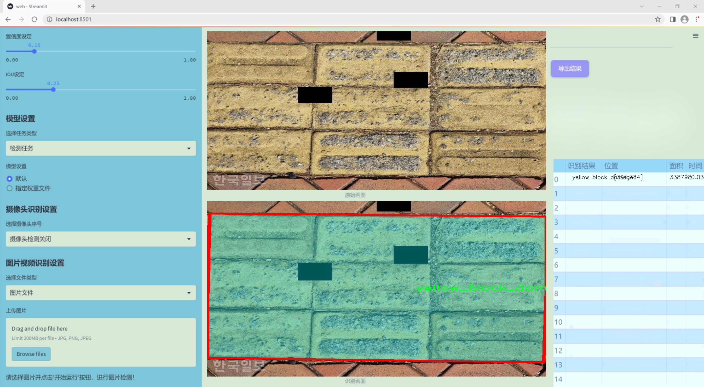
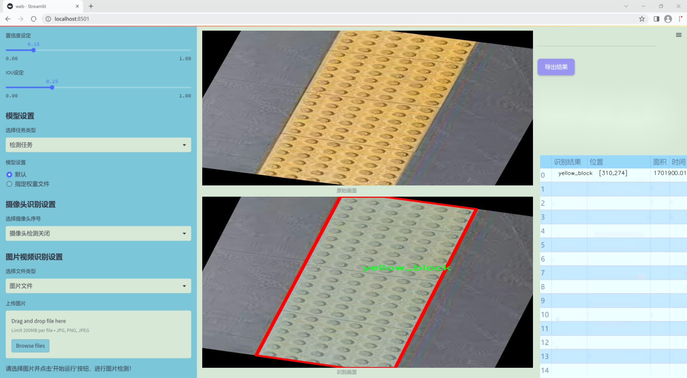
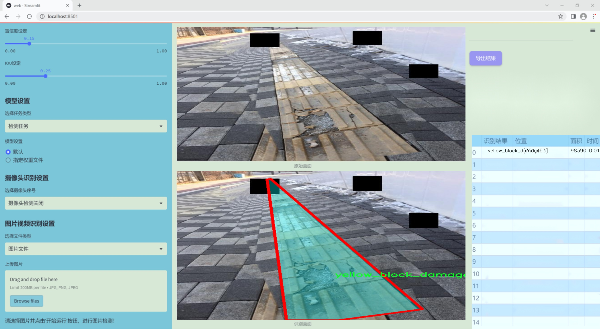
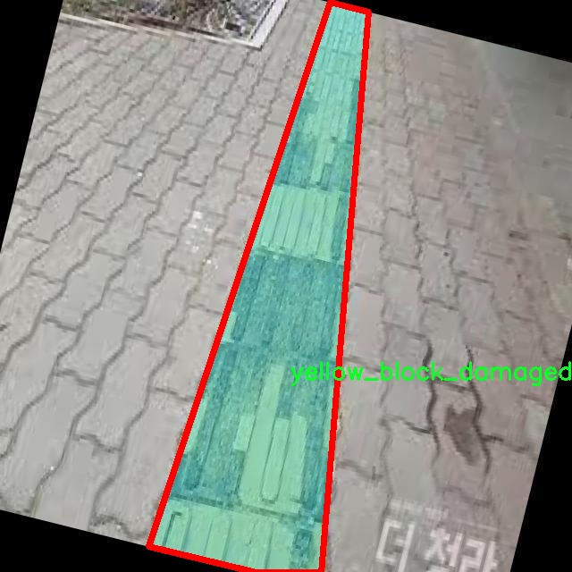
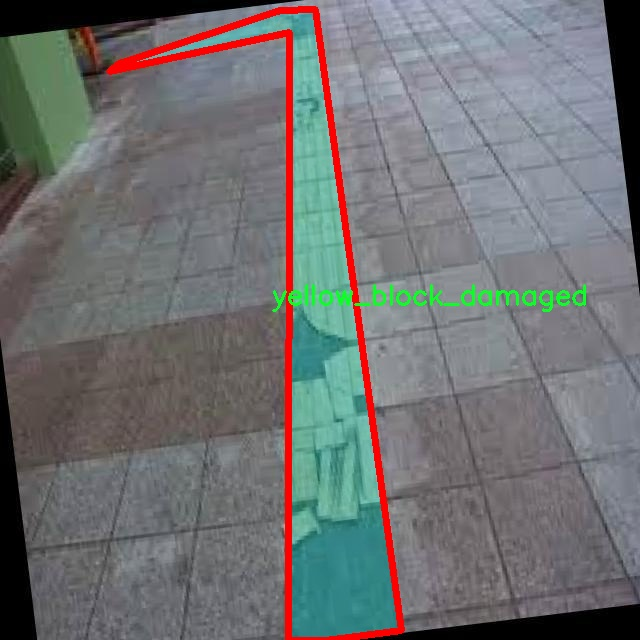
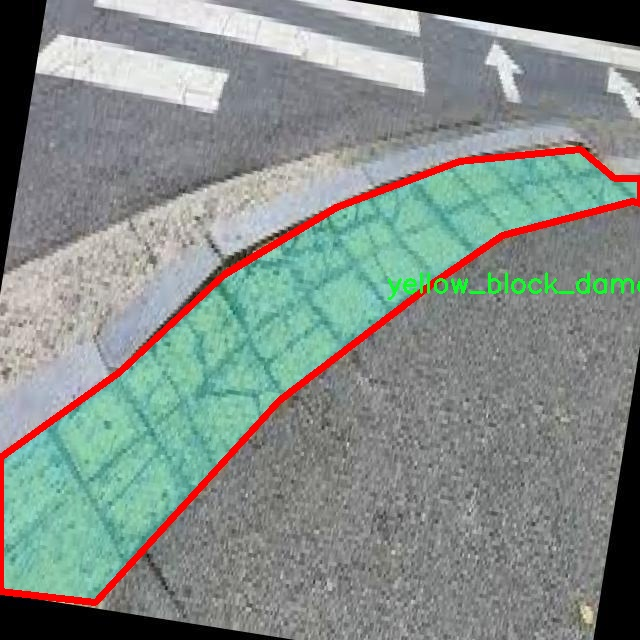
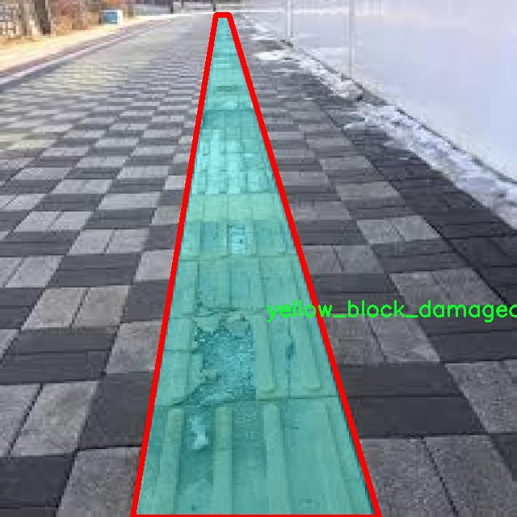
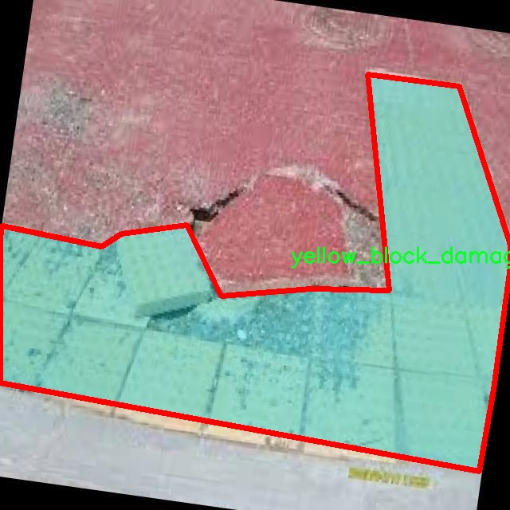

### 1.背景意义

### 研究背景与意义

随着城市化进程的加快，城市基础设施的建设与维护显得尤为重要。盲道作为城市公共设施的重要组成部分，不仅为视障人士提供了安全的出行通道，也在提升城市人性化设计方面发挥着重要作用。然而，随着时间的推移，盲道在使用过程中容易出现损坏，影响其功能的发挥，甚至可能对使用者造成安全隐患。因此，及时、准确地检测盲道的损坏情况，成为了城市管理者亟需解决的问题。

传统的盲道损坏检测方法多依赖人工巡查，效率低下且容易受到主观因素的影响。近年来，计算机视觉技术的快速发展为盲道损坏检测提供了新的解决方案。基于深度学习的图像分割技术，尤其是YOLO（You Only Look Once）系列模型，因其在目标检测和分割任务中的优越性能，逐渐成为研究的热点。YOLOv11作为该系列的最新版本，具备更高的检测精度和实时性，能够有效地处理复杂场景下的图像数据。

本研究旨在基于改进的YOLOv11模型，构建一个高效的盲道图像分割损坏检测系统。通过利用包含1402张图像的数据集，该数据集包含两类标注：正常的“yellow_block”和损坏的“yellow_block_damaged”。该系统不仅能够自动识别和分割盲道的损坏区域，还能为后续的城市基础设施维护提供数据支持和决策依据。通过引入先进的图像处理技术，我们希望能够提高盲道损坏检测的准确性和效率，进而推动城市公共设施的智能化管理，提升视障人士的出行安全与便利性。这一研究不仅具有重要的学术价值，也为实际应用提供了切实可行的解决方案。

### 2.视频效果

[2.1 视频效果](https://www.bilibili.com/video/BV1AcByYvEUA/)

### 3.图片效果







##### [项目涉及的源码数据来源链接](https://kdocs.cn/l/cszuIiCKVNis)**

注意：本项目提供训练的数据集和训练教程,由于版本持续更新,暂不提供权重文件（best.pt）,请按照6.训练教程进行训练后实现上图演示的效果。

### 4.数据集信息

##### 4.1 本项目数据集类别数＆类别名

nc: 2
names: ['yellow_block', 'yellow_block_damaged']


该项目为【图像分割】数据集，请在【训练教程和Web端加载模型教程（第三步）】这一步的时候按照【图像分割】部分的教程来训练

##### 4.2 本项目数据集信息介绍

本项目数据集信息介绍

本项目所使用的数据集专注于“YellowBlock”主题，旨在为改进YOLOv11的盲道图像分割损坏检测系统提供高质量的训练数据。该数据集包含两类主要对象，分别为“yellow_block”和“yellow_block_damaged”。通过对这两类对象的细致标注和分类，我们能够有效地训练模型，以便其在实际应用中能够准确识别和区分完好与损坏的盲道标识。

在数据集的构建过程中，我们特别注重数据的多样性和代表性，以确保模型能够在不同环境和条件下表现出色。数据集中的“yellow_block”类别代表了标准的盲道标识，通常用于指引行人安全通行。而“yellow_block_damaged”类别则涵盖了各种损坏情况，例如磨损、破裂或颜色褪色等。这种分类不仅帮助模型学习到正常状态与损坏状态之间的差异，还能提高其在实际应用中的鲁棒性和准确性。

为了确保数据集的质量，我们在数据收集阶段采用了多种拍摄角度和光照条件，以增强模型的泛化能力。此外，数据集中的图像经过严格的预处理和标注，确保每一张图像都能为模型的训练提供有效的信息。通过这种精心设计的数据集，我们期望能够显著提升YOLOv11在盲道图像分割损坏检测任务中的性能，使其在实际应用中能够快速、准确地识别和定位盲道的损坏情况，从而为城市基础设施的维护和管理提供有力支持。











### 5.全套项目环境部署视频教程（零基础手把手教学）

[5.1 所需软件PyCharm和Anaconda安装教程（第一步）](https://www.bilibili.com/video/BV1BoC1YCEKi/?spm_id_from=333.999.0.0&vd_source=bc9aec86d164b67a7004b996143742dc)


[5.2 安装Python虚拟环境创建和依赖库安装视频教程（第二步）](https://www.bilibili.com/video/BV1ZoC1YCEBw?spm_id_from=333.788.videopod.sections&vd_source=bc9aec86d164b67a7004b996143742dc)

### 6.改进YOLOv11训练教程和Web_UI前端加载模型教程（零基础手把手教学）

[6.1 改进YOLOv11训练教程和Web_UI前端加载模型教程（第三步）](https://www.bilibili.com/video/BV1BoC1YCEhR?spm_id_from=333.788.videopod.sections&vd_source=bc9aec86d164b67a7004b996143742dc)


按照上面的训练视频教程链接加载项目提供的数据集，运行train.py即可开始训练



     Epoch   gpu_mem       box       obj       cls    labels  img_size
     1/200     20.8G   0.01576   0.01955  0.007536        22      1280: 100%|██████████| 849/849 [14:42<00:00,  1.04s/it]
               Class     Images     Labels          P          R     mAP@.5 mAP@.5:.95: 100%|██████████| 213/213 [01:14<00:00,  2.87it/s]
                 all       3395      17314      0.994      0.957      0.0957      0.0843

     Epoch   gpu_mem       box       obj       cls    labels  img_size
     2/200     20.8G   0.01578   0.01923  0.007006        22      1280: 100%|██████████| 849/849 [14:44<00:00,  1.04s/it]
               Class     Images     Labels          P          R     mAP@.5 mAP@.5:.95: 100%|██████████| 213/213 [01:12<00:00,  2.95it/s]
                 all       3395      17314      0.996      0.956      0.0957      0.0845

     Epoch   gpu_mem       box       obj       cls    labels  img_size
     3/200     20.8G   0.01561    0.0191  0.006895        27      1280: 100%|██████████| 849/849 [10:56<00:00,  1.29it/s]
               Class     Images     Labels          P          R     mAP@.5 mAP@.5:.95: 100%|███████   | 187/213 [00:52<00:00,  4.04it/s]
                 all       3395      17314      0.996      0.957      0.0957      0.0845


###### [项目数据集下载链接](https://kdocs.cn/l/cszuIiCKVNis)

### 7.原始YOLOv11算法讲解


##### YOLOv11三大损失函数

YOLOv11（You Only Look Once）是一种流行的目标检测算法，其损失函数设计用于同时优化分类和定位任务。YOLO的损失函数通常包括几个部分：
**分类损失、定位损失（边界框回归损失）和置信度损失** 。其中，

  1. box_loss（边界框回归损失）是用于优化预测边界框与真实边界框之间的差异的部分。

  2. cls_loss（分类损失）是用于优化模型对目标类别的预测准确性的部分。分类损失确保模型能够正确地识别出图像中的对象属于哪个类别。

  3. dfl_loss（Distribution Focal Loss）是YOLO系列中的一种损失函数，特别是在一些改进版本如YOLOv5和YOLOv7中被引入。它的主要目的是解决目标检测中的类别不平衡问题，并提高模型在处理小目标和困难样本时的性能。

##### 边界框回归损失详解

box_loss（边界框回归损失）是用于优化预测边界框与真实边界框之间的差异的部分。


##### box_loss 的具体意义


##### 为什么需要 box_loss

  * 精确定位：通过最小化中心点坐标损失和宽高损失，模型能够更准确地预测目标的位置和大小。
  * 平衡不同类型的目标：使用平方根来处理宽高损失，可以更好地平衡不同大小的目标，确保小目标也能得到足够的关注。
  * 稳定训练：适当的损失函数设计有助于模型的稳定训练，避免梯度爆炸或消失等问题。

##### 分类损失详解

在YOLO（You Only Look
Once）目标检测算法中，cls_loss（分类损失）是用于优化模型对目标类别的预测准确性的部分。分类损失确保模型能够正确地识别出图像中的对象属于哪个类别。下面是关于cls_loss的详细解读：

##### 分类损失 (cls_loss) 的具体意义

  
分类损失通常使用交叉熵损失（Cross-Entropy
Loss）来计算。交叉熵损失衡量的是模型预测的概率分布与真实标签之间的差异。在YOLO中，分类损失的具体形式如下：


##### 为什么需要 cls_loss

  * 类别识别：cls_loss 确保模型能够正确识别出图像中的目标属于哪个类别。这对于目标检测任务至关重要，因为不仅需要知道目标的位置，还需要知道目标的类型。

  * 多类别支持：通过最小化分类损失，模型可以处理多个类别的目标检测任务。例如，在道路缺陷检测中，可能需要识别裂缝、坑洞、路面破损等多种类型的缺陷。

  * 提高准确性：分类损失有助于提高模型的分类准确性，从而提升整体检测性能。通过优化分类损失，模型可以更好地学习不同类别之间的特征差异。

##### 分布损失详解

`dfl_loss`（Distribution Focal
Loss）是YOLO系列中的一种损失函数，特别是在一些改进版本如YOLOv5和YOLOv7中被引入。它的主要目的是解决目标检测中的类别不平衡问题，并提高模型在处理小目标和困难样本时的性能。下面是对`dfl_loss`的详细解读：

##### DFL Loss 的背景

在目标检测任务中，类别不平衡是一个常见的问题。某些类别的样本数量可能远远多于其他类别，这会导致模型在训练过程中对常见类别的学习效果较好，而对罕见类别的学习效果较差。此外，小目标和困难样本的检测也是一个挑战，因为这些目标通常具有较少的特征信息，容易被忽略或误分类。

为了应对这些问题，研究者们提出了多种改进方法，其中之一就是`dfl_loss`。`dfl_loss`通过引入分布焦点损失来增强模型对困难样本的关注，并改善类别不平衡问题。

##### DFL Loss 的定义

DFL Loss
通常与传统的交叉熵损失结合使用，以增强模型对困难样本的学习能力。其核心思想是通过对每个类别的预测概率进行加权，使得模型更加关注那些难以正确分类的样本。

DFL Loss 的公式可以表示为：


##### DFL Loss 的具体意义**

  * **类别不平衡：** 通过引入平衡因子 α，DFL Loss 可以更好地处理类别不平衡问题。对于少数类别的样本，可以通过增加其权重来提升其重要性，从而提高模型对这些类别的检测性能。
  *  **困难样本：** 通过聚焦参数 γ，DFL Loss 可以让模型更加关注那些难以正确分类的样本。当 
  * γ 较大时，模型会对那些预测概率较低的样本给予更多的关注，从而提高这些样本的分类准确性。
  *  **提高整体性能** ：DFL Loss 结合了传统交叉熵损失的优势，并通过加权机制增强了模型对困难样本的学习能力，从而提高了整体的检测性能。


### 8.200+种全套改进YOLOV11创新点原理讲解

#### 8.1 200+种全套改进YOLOV11创新点原理讲解大全

由于篇幅限制，每个创新点的具体原理讲解就不全部展开，具体见下列网址中的改进模块对应项目的技术原理博客网址【Blog】（创新点均为模块化搭建，原理适配YOLOv5~YOLOv11等各种版本）

[改进模块技术原理博客【Blog】网址链接](https://gitee.com/qunmasj/good)


#### 8.2 精选部分改进YOLOV11创新点原理讲解

###### 这里节选部分改进创新点展开原理讲解(完整的改进原理见上图和[改进模块技术原理博客链接](https://gitee.com/qunmasj/good)【如果此小节的图加载失败可以通过CSDN或者Github搜索该博客的标题访问原始博客，原始博客图片显示正常】

### MS-Block简介
实时目标检测，以YOLO系列为例，已在工业领域中找到重要应用，特别是在边缘设备（如无人机和机器人）中。与之前的目标检测器不同，实时目标检测器旨在在速度和准确性之间追求最佳平衡。为了实现这一目标，提出了大量的工作：从第一代DarkNet到CSPNet，再到最近的扩展ELAN，随着性能的快速增长，实时目标检测器的架构经历了巨大的变化。

尽管性能令人印象深刻，但在不同尺度上识别对象仍然是实时目标检测器面临的基本挑战。这促使作者设计了一个强大的编码器架构，用于学习具有表现力的多尺度特征表示。具体而言，作者从两个新的角度考虑为实时目标检测编码多尺度特征：

从局部视角出发，作者设计了一个具有简单而有效的分层特征融合策略的MS-Block。受到Res2Net的启发，作者在MS-Block中引入了多个分支来进行特征提取，但不同的是，作者使用了一个带有深度卷积的 Inverted Bottleneck Block块，以实现对大Kernel的高效利用。

从全局视角出发，作者提出随着网络加深逐渐增加卷积的Kernel-Size。作者在浅层使用小Kernel卷积来更高效地处理高分辨率特征。另一方面，在深层中，作者采用大Kernel卷积来捕捉广泛的信息。

基于以上设计原则，作者呈现了作者的实时目标检测器，称为YOLO-MS。为了评估作者的YOLO-MS的性能，作者在MS COCO数据集上进行了全面的实验。还提供了与其他最先进方法的定量比较，以展示作者方法的强大性能。如图1所示，YOLO-MS在计算性能平衡方面优于其他近期的实时目标检测器。


具体而言，YOLO-MS-XS在MS COCO上获得了43%+的AP得分，仅具有450万个可学习参数和8.7亿个FLOPs。YOLO-MS-S和YOLO-MS分别获得了46%+和51%+的AP，可学习参数分别为810万和2220万。此外，作者的工作还可以作为其他YOLO模型的即插即用模块。通常情况下，作者的方法可以将YOLOv11的AP从37%+显著提高到40%+，甚至还可以使用更少的参数和FLOPs。

CSP Block是一个基于阶段级梯度路径的网络，平衡了梯度组合和计算成本。它是广泛应用于YOLO系列的基本构建块。已经提出了几种变体，包括YOLOv4和YOLOv11中的原始版本，Scaled YOLOv4中的CSPVoVNet，YOLOv11中的ELAN，以及RTMDet中提出的大Kernel单元。作者在图2(a)和图2(b)中分别展示了原始CSP块和ELAN的结构。


上述实时检测器中被忽视的一个关键方面是如何在基本构建块中编码多尺度特征。其中一个强大的设计原则是Res2Net，它聚合了来自不同层次的特征以增强多尺度表示。然而，这一原则并没有充分探索大Kernel卷积的作用，而大Kernel卷积已经在基于CNN的视觉识别任务模型中证明有效。将大Kernel卷积纳入Res2Net的主要障碍在于它们引入的计算开销，因为构建块采用了标准卷积。在作者的方法中，作者提出用 Inverted Bottleneck Block替代标准的3 × 3卷积，以享受大Kernel卷积的好处。

#### MS-Block

基于前面的分析，参考该博客提出了一个带有分层特征融合策略的全新Block，称为MS-Block，以增强实时目标检测器在提取多尺度特征时的能力，同时保持快速的推理速度。

MS-Block的具体结构如图2(c)所示。假设是输入特征。通过1×1卷积的转换后，X的通道维度增加到n*C。然后，作者将X分割成n个不同的组，表示为，其中。为了降低计算成本，作者选择n为3。

注意，除了之外，每个其他组都经过一个 Inverted Bottleneck Block层，用表示，其中k表示Kernel-Size，以获得。的数学表示如下：


根据这个公式，作者不将 Inverted Bottleneck Block层连接到，使其作为跨阶段连接，并保留来自前面层的信息。最后，作者将所有分割连接在一起，并应用1×1卷积来在所有分割之间进行交互，每个分割都编码不同尺度的特征。当网络加深时，这个1×1卷积也用于调整通道数。

#### Heterogeneous Kernel Selection Protocol
除了构建块的设计外，作者还从宏观角度探讨了卷积的使用。之前的实时目标检测器在不同的编码器阶段采用了同质卷积（即具有相同Kernel-Size的卷积），但作者认为这不是提取多尺度语义信息的最佳选项。

在金字塔结构中，从检测器的浅阶段提取的高分辨率特征通常用于捕捉细粒度语义，将用于检测小目标。相反，来自网络较深阶段的低分辨率特征用于捕捉高级语义，将用于检测大目标。如果作者在所有阶段都采用统一的小Kernel卷积，深阶段的有效感受野（ERF）将受到限制，影响大目标的性能。在每个阶段中引入大Kernel卷积可以帮助解决这个问题。然而，具有大的ERF的大Kernel可以编码更广泛的区域，这增加了在小目标外部包含噪声信息的概率，并且降低了推理速度。

在这项工作中，作者建议在不同阶段中采用异构卷积，以帮助捕获更丰富的多尺度特征。具体来说，在编码器的第一个阶段中，作者采用最小Kernel卷积，而最大Kernel卷积位于最后一个阶段。随后，作者逐步增加中间阶段的Kernel-Size，使其与特征分辨率的增加保持一致。这种策略允许提取细粒度和粗粒度的语义信息，增强了编码器的多尺度特征表示能力。

正如图所示，作者将k的值分别分配给编码器中的浅阶段到深阶段，取值为3、5、7和9。作者将其称为异构Kernel选择（HKS）协议。


作者的HKS协议能够在深层中扩大感受野，而不会对浅层产生任何其他影响。第4节的图4支持了作者的分析。此外，HKS不仅有助于编码更丰富的多尺度特征，还确保了高效的推理。

如表1所示，将大Kernel卷积应用于高分辨率特征会产生较高的计算开销。然而，作者的HKS协议在低分辨率特征上采用大Kernel卷积，从而与仅使用大Kernel卷积相比，大大降低了计算成本。


在实践中，作者经验性地发现，采用HKS协议的YOLO-MS的推理速度几乎与仅使用深度可分离的3 × 3卷积相同。


如图所示，作者模型的Backbone由4个阶段组成，每个阶段后面跟随1个步长为2的3 × 3卷积进行下采样。在第3个阶段后，作者添加了1个SPP块，与RTMDet中一样。在作者的编码器上，作者使用PAFPN作为Neck来构建特征金字塔[31, 35]。它融合了从Backbone不同阶段提取的多尺度特征。Neck中使用的基本构建块也是作者的MS-Block，在其中使用3 × 3深度可分离卷积进行快速推理。

此外，为了在速度和准确性之间取得更好的平衡，作者将Backbone中多级特征的通道深度减半。作者提供了3个不同尺度的YOLO-MS变体，即YOLO-MS-XS、YOLO-MS-S和YOLO-MS。不同尺度的YOLO-MS的详细配置列在表2中。对于YOLO-MS的其他部分，作者将其保持与RTMDet相同。


### 9.系统功能展示

图9.1.系统支持检测结果表格显示

  图9.2.系统支持置信度和IOU阈值手动调节

  图9.3.系统支持自定义加载权重文件best.pt(需要你通过步骤5中训练获得)

  图9.4.系统支持摄像头实时识别

  图9.5.系统支持图片识别

  图9.6.系统支持视频识别

  图9.7.系统支持识别结果文件自动保存

  图9.8.系统支持Excel导出检测结果数据


### 10. YOLOv11核心改进源码讲解

#### 10.1 test_selective_scan_easy.py

以下是对代码的核心部分进行的分析和详细注释：

```python
import torch
import torch.nn.functional as F

def selective_scan_easy(us, dts, As, Bs, Cs, Ds, delta_bias=None, delta_softplus=False, return_last_state=False, chunksize=64):
    """
    选择性扫描函数，进行状态更新和输出计算。
    
    参数：
    us: 输入张量，形状为 (B, G * D, L)
    dts: 时间增量张量，形状为 (B, G * D, L)
    As: 状态转移矩阵，形状为 (G * D, N)
    Bs: 输入权重矩阵，形状为 (B, G, N, L)
    Cs: 输出权重矩阵，形状为 (B, G, N, L)
    Ds: 额外的输入张量，形状为 (G * D)
    delta_bias: 可选的偏置调整，形状为 (G * D)
    delta_softplus: 是否应用softplus函数
    return_last_state: 是否返回最后的状态
    chunksize: 每次处理的时间步数
    """
    
    def selective_scan_chunk(us, dts, As, Bs, Cs, hprefix):
        """
        处理每个时间块的选择性扫描。
        
        参数：
        us: 当前输入张量块
        dts: 当前时间增量块
        As: 状态转移矩阵
        Bs: 输入权重矩阵块
        Cs: 输出权重矩阵块
        hprefix: 前一个状态
        
        返回：
        ys: 当前块的输出
        hs: 当前块的状态
        """
        ts = dts.cumsum(dim=0)  # 计算时间增量的累积和
        Ats = torch.einsum("gdn,lbgd->lbgdn", As, ts).exp()  # 计算状态转移的指数
        scale = 1  # 缩放因子
        rAts = Ats / scale  # 归一化的状态转移
        duts = dts * us  # 输入与时间增量的乘积
        dtBus = torch.einsum("lbgd,lbgn->lbgdn", duts, Bs)  # 计算输入权重的贡献
        hs_tmp = rAts * (dtBus / rAts).cumsum(dim=0)  # 计算当前状态
        hs = hs_tmp + Ats * hprefix.unsqueeze(0)  # 加上前一个状态的影响
        ys = torch.einsum("lbgn,lbgdn->lbgd", Cs, hs)  # 计算输出
        return ys, hs

    # 数据类型设置
    dtype = torch.float32
    inp_dtype = us.dtype  # 输入数据类型
    has_D = Ds is not None  # 检查Ds是否存在
    if chunksize < 1:
        chunksize = Bs.shape[-1]  # 如果chunksize小于1，使用Bs的最后一个维度

    # 处理输入数据
    dts = dts.to(dtype)
    if delta_bias is not None:
        dts = dts + delta_bias.view(1, -1, 1).to(dtype)  # 添加偏置
    if delta_softplus:
        dts = F.softplus(dts)  # 应用softplus函数

    # 处理Bs和Cs的维度
    if len(Bs.shape) == 3:
        Bs = Bs.unsqueeze(1)
    if len(Cs.shape) == 3:
        Cs = Cs.unsqueeze(1)

    # 重新排列输入数据的维度
    B, G, N, L = Bs.shape
    us = us.view(B, G, -1, L).permute(3, 0, 1, 2).to(dtype)
    dts = dts.view(B, G, -1, L).permute(3, 0, 1, 2).to(dtype)
    As = As.view(G, -1, N).to(dtype)
    Bs = Bs.permute(3, 0, 1, 2).to(dtype)
    Cs = Cs.permute(3, 0, 1, 2).to(dtype)
    Ds = Ds.view(G, -1).to(dtype) if has_D else None
    D = As.shape[1]  # 状态维度

    oys = []  # 存储输出
    hprefix = us.new_zeros((B, G, D, N), dtype=dtype)  # 初始化前一个状态
    for i in range(0, L, chunksize):
        # 处理每个时间块
        ys, hs = selective_scan_chunk(
            us[i:i + chunksize], dts[i:i + chunksize], 
            As, Bs[i:i + chunksize], Cs[i:i + chunksize], hprefix, 
        )
        oys.append(ys)  # 添加输出
        hprefix = hs[-1]  # 更新前一个状态

    oys = torch.cat(oys, dim=0)  # 合并所有输出
    if has_D:
        oys = oys + Ds * us  # 如果Ds存在，添加额外的输入
    oys = oys.permute(1, 2, 3, 0).view(B, -1, L)  # 重新排列输出的维度

    return oys.to(inp_dtype) if not return_last_state else (oys.to(inp_dtype), hprefix.view(B, G * D, N).float())
```

### 代码核心部分说明：
1. **函数定义**：`selective_scan_easy` 是一个选择性扫描的实现，主要用于在给定的输入和状态转移矩阵下计算输出。
2. **参数处理**：函数接收多个参数，包括输入张量、时间增量、状态转移矩阵等，并进行必要的维度调整和数据类型转换。
3. **选择性扫描块**：内部函数 `selective_scan_chunk` 负责处理每个时间块的计算，包括状态更新和输出计算。
4. **输出合并**：在处理完所有时间块后，将输出合并并返回最终结果。

通过这种方式，代码的核心逻辑得以保留，并且每个部分都有详细的中文注释，便于理解其功能和实现。

这个文件 `test_selective_scan_easy.py` 是一个用于测试和实现选择性扫描（Selective Scan）算法的 Python 脚本，主要依赖于 PyTorch 库。文件中包含了选择性扫描的实现、相关的数学运算以及用于测试的代码。

首先，文件导入了一些必要的库，包括 `math`、`functools`、`torch`、`torch.nn.functional`、`pytest` 和 `einops`。这些库提供了数学计算、函数式编程、深度学习框架和张量操作的支持。

接下来，定义了一个名为 `selective_scan_easy` 的函数。这个函数的主要目的是实现选择性扫描算法，输入参数包括多个张量（如 `us`、`dts`、`As`、`Bs`、`Cs`、`Ds` 等），并可以选择性地应用偏置和 softplus 激活函数。函数内部还定义了一个 `selective_scan_chunk` 的嵌套函数，用于处理数据块的选择性扫描逻辑。

在 `selective_scan_easy` 函数中，首先对输入数据进行类型转换和形状调整。然后，利用循环对输入序列进行分块处理，调用 `selective_scan_chunk` 函数进行具体的计算，最后将结果合并并返回。

此外，文件中还定义了一个 `SelectiveScanEasy` 类，继承自 `torch.autograd.Function`，用于实现自定义的前向和反向传播逻辑。该类中的 `forward` 方法实现了选择性扫描的前向计算，而 `backward` 方法则实现了反向传播计算，以便于在训练过程中计算梯度。

在后续的函数 `selective_scan_easy_fwdbwd` 和 `selective_scan_easyv2` 中，分别实现了不同版本的选择性扫描算法，提供了更多的灵活性和功能。

文件的最后部分是测试代码，使用 `pytest` 框架对选择性扫描的实现进行单元测试。通过参数化测试，测试不同的输入配置和边界条件，确保选择性扫描算法的正确性和稳定性。

总的来说，这个文件实现了选择性扫描算法的核心逻辑，并通过测试代码确保其功能的正确性，适用于深度学习模型中的序列数据处理。

#### 10.2 CSwomTramsformer.py

以下是经过简化并添加详细中文注释的核心代码部分：

```python
import torch
import torch.nn as nn
import numpy as np

class Mlp(nn.Module):
    """多层感知机（MLP）模块"""
    def __init__(self, in_features, hidden_features=None, out_features=None, act_layer=nn.GELU, drop=0.):
        super().__init__()
        out_features = out_features or in_features  # 输出特征数
        hidden_features = hidden_features or in_features  # 隐藏层特征数
        self.fc1 = nn.Linear(in_features, hidden_features)  # 第一层线性变换
        self.act = act_layer()  # 激活函数
        self.fc2 = nn.Linear(hidden_features, out_features)  # 第二层线性变换
        self.drop = nn.Dropout(drop)  # Dropout层

    def forward(self, x):
        """前向传播"""
        x = self.fc1(x)  # 线性变换
        x = self.act(x)  # 激活
        x = self.drop(x)  # Dropout
        x = self.fc2(x)  # 线性变换
        x = self.drop(x)  # Dropout
        return x

class CSWinBlock(nn.Module):
    """CSWin Transformer中的一个块"""
    def __init__(self, dim, num_heads, mlp_ratio=4., drop=0., attn_drop=0., norm_layer=nn.LayerNorm):
        super().__init__()
        self.dim = dim  # 输入特征维度
        self.num_heads = num_heads  # 注意力头数
        self.mlp_ratio = mlp_ratio  # MLP的扩展比例
        self.norm1 = norm_layer(dim)  # 第一层归一化
        self.qkv = nn.Linear(dim, dim * 3)  # 线性变换生成Q、K、V

        # 注意力层
        self.attn = LePEAttention(dim, num_heads=num_heads, attn_drop=attn_drop)

        # MLP层
        mlp_hidden_dim = int(dim * mlp_ratio)  # 隐藏层维度
        self.mlp = Mlp(in_features=dim, hidden_features=mlp_hidden_dim, out_features=dim)

        self.norm2 = norm_layer(dim)  # 第二层归一化

    def forward(self, x):
        """前向传播"""
        x = self.norm1(x)  # 归一化
        qkv = self.qkv(x).reshape(x.shape[0], -1, 3, self.dim).permute(2, 0, 1, 3)  # 生成Q、K、V
        x = self.attn(qkv)  # 注意力计算
        x = x + self.drop_path(x)  # 残差连接
        x = x + self.drop_path(self.mlp(self.norm2(x)))  # MLP和残差连接
        return x

class CSWinTransformer(nn.Module):
    """CSWin Transformer模型"""
    def __init__(self, img_size=640, in_chans=3, num_classes=1000, embed_dim=96, depth=[2,2,6,2], num_heads=12):
        super().__init__()
        self.num_classes = num_classes
        self.embed_dim = embed_dim  # 嵌入维度

        # 初始卷积嵌入层
        self.stage1_conv_embed = nn.Sequential(
            nn.Conv2d(in_chans, embed_dim, kernel_size=7, stride=4, padding=2),
            nn.LayerNorm(embed_dim)
        )

        # CSWinBlock的多个阶段
        self.stage1 = nn.ModuleList([
            CSWinBlock(dim=embed_dim, num_heads=num_heads) for _ in range(depth[0])
        ])
        # 继续添加其他阶段...

    def forward(self, x):
        """前向传播"""
        x = self.stage1_conv_embed(x)  # 初始卷积嵌入
        for blk in self.stage1:
            x = blk(x)  # 通过每个CSWinBlock
        return x

# 其他函数和模型注册代码省略...
```

### 代码说明：
1. **Mlp类**：实现了一个多层感知机，包含两个线性层和一个激活函数，支持Dropout。
2. **CSWinBlock类**：实现了CSWin Transformer中的一个基本块，包含注意力机制和MLP结构，使用残差连接。
3. **CSWinTransformer类**：定义了整个CSWin Transformer模型，包括初始的卷积嵌入层和多个CSWinBlock的堆叠。

这段代码展示了CSWin Transformer的基本结构和工作流程，核心部分主要集中在模型的块和前向传播的实现上。

这个程序文件实现了一个名为CSWin Transformer的深度学习模型，主要用于计算机视觉任务。代码中包含了多个类和函数，具体功能如下：

首先，导入了必要的库，包括PyTorch及其模块、一些辅助函数和工具，如timm库中的功能和einops库中的重排层。这些库为模型的构建和训练提供了基础。

接下来，定义了一个名为Mlp的类，这是一个多层感知机（MLP），它包含两个线性层和一个激活函数（默认为GELU），并在每个线性层后添加了Dropout以防止过拟合。该类的forward方法实现了数据的前向传播。

然后，定义了LePEAttention类，它实现了一种新的注意力机制。该类的构造函数中定义了输入维度、分辨率、头数等参数，并初始化了卷积层和Dropout层。该类的forward方法实现了对输入的查询、键、值的处理，并计算注意力分数，最后返回经过注意力机制处理后的结果。

CSWinBlock类是模型的基本构建块，它结合了MLP和LePEAttention。构造函数中定义了多个参数，包括输入维度、头数、分辨率等，并初始化了相关层。在forward方法中，首先对输入进行归一化，然后计算查询、键、值，并通过注意力机制处理，最后将结果与输入相加并经过MLP处理。

接下来，定义了img2windows和windows2img两个辅助函数，用于将图像数据转换为窗口格式以及将窗口格式的数据转换回图像格式。这些函数在处理图像时非常重要，因为它们帮助模型有效地处理局部信息。

Merge_Block类用于在不同阶段之间合并特征图，它通过卷积层和归一化层实现了特征的下采样。

CSWinTransformer类是整个模型的核心，负责构建整个网络结构。构造函数中定义了输入图像的大小、补丁大小、输入通道数、类别数、嵌入维度、深度等参数，并依次构建了多个阶段的网络。每个阶段由多个CSWinBlock组成，并通过Merge_Block进行特征合并。模型的forward_features方法实现了特征的前向传播，并在每个阶段提取特征。

最后，定义了一些辅助函数，如_conv_filter和update_weight，用于处理模型权重的更新和转换。此外，还定义了CSWin_tiny、CSWin_small、CSWin_base和CSWin_large等函数，分别构建不同规模的CSWin Transformer模型，并支持加载预训练权重。

在主程序中，创建了随机输入数据，并实例化了不同规模的模型，进行前向传播并打印输出特征的尺寸。这部分代码用于测试模型的构建和功能是否正常。

总体来说，这个程序实现了一个高效的视觉Transformer模型，结合了多种先进的技术，适用于各种计算机视觉任务。

#### 10.3 hcfnet.py

以下是代码中最核心的部分，并附上详细的中文注释：

```python
import torch
import torch.nn as nn
import torch.nn.functional as F

class SpatialAttentionModule(nn.Module):
    def __init__(self):
        super(SpatialAttentionModule, self).__init__()
        # 定义一个卷积层，用于生成空间注意力图
        self.conv2d = nn.Conv2d(in_channels=2, out_channels=1, kernel_size=7, stride=1, padding=3)
        self.sigmoid = nn.Sigmoid()  # 使用Sigmoid激活函数将输出限制在0到1之间

    def forward(self, x):
        # 计算输入特征图的平均值和最大值
        avgout = torch.mean(x, dim=1, keepdim=True)  # 在通道维度上求平均
        maxout, _ = torch.max(x, dim=1, keepdim=True)  # 在通道维度上求最大值
        # 将平均值和最大值拼接在一起
        out = torch.cat([avgout, maxout], dim=1)
        # 通过卷积层和Sigmoid激活函数生成空间注意力图
        out = self.sigmoid(self.conv2d(out))
        # 将输入特征图与空间注意力图相乘，增强重要特征
        return out * x

class PPA(nn.Module):
    def __init__(self, in_features, filters) -> None:
        super().__init__()
        # 定义多个卷积层和注意力模块
        self.skip = nn.Conv2d(in_features, filters, kernel_size=1, bias=False)  # 跳跃连接
        self.c1 = nn.Conv2d(filters, filters, kernel_size=3, padding=1)
        self.c2 = nn.Conv2d(filters, filters, kernel_size=3, padding=1)
        self.c3 = nn.Conv2d(filters, filters, kernel_size=3, padding=1)
        self.sa = SpatialAttentionModule()  # 空间注意力模块
        self.drop = nn.Dropout2d(0.1)  # Dropout层，防止过拟合
        self.bn1 = nn.BatchNorm2d(filters)  # 批归一化
        self.silu = nn.SiLU()  # SiLU激活函数

    def forward(self, x):
        # 通过卷积层和跳跃连接处理输入
        x_skip = self.skip(x)
        x1 = self.c1(x)
        x2 = self.c2(x1)
        x3 = self.c3(x2)
        # 将多个特征图相加
        x = x1 + x2 + x3 + x_skip
        x = self.sa(x)  # 应用空间注意力模块
        x = self.drop(x)  # 应用Dropout
        x = self.bn1(x)  # 应用批归一化
        x = self.silu(x)  # 应用SiLU激活函数
        return x

class DASI(nn.Module):
    def __init__(self, in_features, out_features) -> None:
        super().__init__()
        # 定义多个卷积层和Bag模块
        self.bag = Bag()  # Bag模块
        self.tail_conv = nn.Conv2d(out_features, out_features, kernel_size=1)
        self.conv = nn.Conv2d(out_features // 2, out_features // 4, kernel_size=1)
        self.bns = nn.BatchNorm2d(out_features)

        # 定义跳跃连接的卷积层
        self.skips = nn.Conv2d(in_features[1], out_features, kernel_size=1)
        self.skips_2 = nn.Conv2d(in_features[0], out_features, kernel_size=1)
        self.skips_3 = nn.Conv2d(in_features[2], out_features, kernel_size=3, stride=2, dilation=2, padding=2)
        self.silu = nn.SiLU()  # SiLU激活函数

    def forward(self, x_list):
        # 解包输入特征图
        x_low, x, x_high = x_list
        x_high = self.skips_3(x_high) if x_high is not None else None
        x_low = self.skips_2(x_low) if x_low is not None else None
        x = self.skips(x)  # 处理主特征图
        x_skip = x  # 保存跳跃连接的特征图
        x = torch.chunk(x, 4, dim=1)  # 将特征图分成4个部分

        # 根据高低特征图的存在情况进行不同的处理
        if x_high is None:
            x0 = self.conv(torch.cat((x[0], x_low[0]), dim=1)) if x_low is not None else self.conv(x[0])
            x1 = self.conv(torch.cat((x[1], x_low[1]), dim=1)) if x_low is not None else self.conv(x[1])
            x2 = self.conv(torch.cat((x[2], x_low[2]), dim=1)) if x_low is not None else self.conv(x[2])
            x3 = self.conv(torch.cat((x[3], x_low[3]), dim=1)) if x_low is not None else self.conv(x[3])
        else:
            x0 = self.bag(x_low[0], x_high[0], x[0])
            x1 = self.bag(x_low[1], x_high[1], x[1])
            x2 = self.bag(x_low[2], x_high[2], x[2])
            x3 = self.bag(x_low[3], x_high[3], x[3])

        # 将处理后的特征图拼接
        x = torch.cat((x0, x1, x2, x3), dim=1)
        x = self.tail_conv(x)  # 通过尾部卷积层
        x += x_skip  # 加上跳跃连接
        x = self.bns(x)  # 应用批归一化
        x = self.silu(x)  # 应用SiLU激活函数

        return x
```

### 代码核心部分说明：
1. **SpatialAttentionModule**：实现了空间注意力机制，通过计算输入特征图的平均值和最大值，生成注意力图并加权输入特征图，增强重要特征。
2. **PPA**：主网络结构，包含多个卷积层和空间注意力模块，通过跳跃连接和多层特征融合来提高特征表达能力。
3. **DASI**：通过Bag模块融合不同层次的特征图，使用卷积层和激活函数进行处理，最终输出融合后的特征图。

这个程序文件 `hcfnet.py` 实现了一个深度学习模型的几个组件，主要用于图像处理任务。文件中定义了多个类，每个类代表一个特定的模块，主要包括空间注意力模块、局部全局注意力模块、ECA（Efficient Channel Attention）、PPA（Parallel Processing Attention）和DASI（Dual Attention Spatial Interaction）。

首先，`SpatialAttentionModule` 类实现了一个空间注意力机制。该模块通过计算输入特征图的平均值和最大值来生成注意力图，然后通过卷积层和Sigmoid激活函数处理这些特征，最终将注意力图与输入特征图相乘，从而突出重要的空间信息。

接下来，`LocalGlobalAttention` 类实现了局部和全局注意力机制。该模块首先将输入特征图分割成小块（patches），然后通过多层感知机（MLP）处理这些小块以提取特征。接着，计算这些特征的注意力权重，并通过余弦相似度与一个可学习的提示向量进行结合，最终输出增强后的特征图。

`ECA` 类实现了一种高效的通道注意力机制。它通过自适应平均池化来生成通道特征，并使用一维卷积来计算通道之间的关系，最后通过Sigmoid激活函数生成通道注意力权重并与输入特征图相乘。

`PPA` 类是一个综合模块，结合了多个卷积层、空间注意力模块、ECA和局部全局注意力模块。它通过跳跃连接（skip connection）将不同层的特征结合在一起，增强特征的表达能力，并在最后应用批归一化和激活函数（SiLU）来提高模型的非线性表达能力。

`Bag` 类实现了一个简单的加权融合机制，通过计算边缘注意力来对输入特征进行加权组合。

最后，`DASI` 类是一个更复杂的模块，负责处理多个输入特征图。它通过跳跃连接和融合机制将不同分辨率的特征结合在一起，使用卷积层进行特征变换，并在最后应用批归一化和激活函数。这个模块能够有效地整合来自不同层次的信息，增强模型的表现。

整体来看，这个文件实现了一种结合了多种注意力机制和特征融合策略的深度学习模型，旨在提高图像处理任务中的特征提取和表示能力。

#### 10.4 attention.py

以下是代码中最核心的部分，并附上详细的中文注释：

```python
import torch
from torch import nn

class EMA(nn.Module):
    """
    Exponential Moving Average (EMA) 模块
    """
    def __init__(self, channels, factor=8):
        super(EMA, self).__init__()
        self.groups = factor  # 将通道分为若干组
        assert channels // self.groups > 0  # 确保每组至少有一个通道
        self.softmax = nn.Softmax(-1)  # 用于计算权重的softmax
        self.agp = nn.AdaptiveAvgPool2d((1, 1))  # 自适应平均池化
        self.pool_h = nn.AdaptiveAvgPool2d((None, 1))  # 针对高度的池化
        self.pool_w = nn.AdaptiveAvgPool2d((1, None))  # 针对宽度的池化
        self.gn = nn.GroupNorm(channels // self.groups, channels // self.groups)  # 组归一化
        self.conv1x1 = nn.Conv2d(channels // self.groups, channels // self.groups, kernel_size=1)  # 1x1卷积
        self.conv3x3 = nn.Conv2d(channels // self.groups, channels // self.groups, kernel_size=3, padding=1)  # 3x3卷积

    def forward(self, x):
        b, c, h, w = x.size()  # 获取输入的尺寸
        group_x = x.reshape(b * self.groups, -1, h, w)  # 将输入重塑为分组形式
        x_h = self.pool_h(group_x)  # 对高度进行池化
        x_w = self.pool_w(group_x).permute(0, 1, 3, 2)  # 对宽度进行池化并调整维度
        hw = self.conv1x1(torch.cat([x_h, x_w], dim=2))  # 1x1卷积处理
        x_h, x_w = torch.split(hw, [h, w], dim=2)  # 分割回高度和宽度
        x1 = self.gn(group_x * x_h.sigmoid() * x_w.permute(0, 1, 3, 2).sigmoid())  # 组归一化
        x2 = self.conv3x3(group_x)  # 3x3卷积处理
        x11 = self.softmax(self.agp(x1).reshape(b * self.groups, -1, 1).permute(0, 2, 1))  # 计算权重
        x12 = x2.reshape(b * self.groups, c // self.groups, -1)  # 重塑x2
        x21 = self.softmax(self.agp(x2).reshape(b * self.groups, -1, 1).permute(0, 2, 1))  # 计算权重
        x22 = x1.reshape(b * self.groups, c // self.groups, -1)  # 重塑x1
        weights = (torch.matmul(x11, x12) + torch.matmul(x21, x22)).reshape(b * self.groups, 1, h, w)  # 计算最终权重
        return (group_x * weights.sigmoid()).reshape(b, c, h, w)  # 返回加权后的输出

class SimAM(nn.Module):
    """
    SimAM 模块
    """
    def __init__(self, e_lambda=1e-4):
        super(SimAM, self).__init__()
        self.activaton = nn.Sigmoid()  # Sigmoid激活函数
        self.e_lambda = e_lambda  # 正则化参数

    def forward(self, x):
        b, c, h, w = x.size()  # 获取输入的尺寸
        n = w * h - 1  # 计算样本数

        # 计算均值平方差
        x_minus_mu_square = (x - x.mean(dim=[2, 3], keepdim=True)).pow(2)
        # 计算y
        y = x_minus_mu_square / (4 * (x_minus_mu_square.sum(dim=[2, 3], keepdim=True) / n + self.e_lambda)) + 0.5

        return x * self.activaton(y)  # 返回加权后的输出

class SpatialGroupEnhance(nn.Module):
    """
    空间组增强模块
    """
    def __init__(self, groups=8):
        super().__init__()
        self.groups = groups  # 组数
        self.avg_pool = nn.AdaptiveAvgPool2d(1)  # 自适应平均池化
        self.weight = nn.Parameter(torch.zeros(1, groups, 1, 1))  # 权重参数
        self.bias = nn.Parameter(torch.zeros(1, groups, 1, 1))  # 偏置参数
        self.sig = nn.Sigmoid()  # Sigmoid激活函数
        self.init_weights()  # 初始化权重

    def init_weights(self):
        for m in self.modules():
            if isinstance(m, nn.Conv2d):
                nn.init.kaiming_normal_(m.weight, mode='fan_out')  # Kaiming初始化
                if m.bias is not None:
                    nn.init.constant_(m.bias, 0)  # 偏置初始化为0
            elif isinstance(m, nn.BatchNorm2d):
                nn.init.constant_(m.weight, 1)  # BN权重初始化为1
                nn.init.constant_(m.bias, 0)  # BN偏置初始化为0
            elif isinstance(m, nn.Linear):
                nn.init.normal_(m.weight, std=0.001)  # 线性层权重初始化
                if m.bias is not None:
                    nn.init.constant_(m.bias, 0)  # 偏置初始化为0

    def forward(self, x):
        b, c, h, w = x.shape  # 获取输入的尺寸
        x = x.view(b * self.groups, -1, h, w)  # 重塑输入
        xn = x * self.avg_pool(x)  # 计算平均池化
        xn = xn.sum(dim=1, keepdim=True)  # 对组求和
        t = xn.view(b * self.groups, -1)  # 重塑
        t = t - t.mean(dim=1, keepdim=True)  # 去均值
        std = t.std(dim=1, keepdim=True) + 1e-5  # 计算标准差
        t = t / std  # 归一化
        t = t.view(b, self.groups, h, w)  # 重塑
        t = t * self.weight + self.bias  # 加权和偏置
        t = t.view(b * self.groups, 1, h, w)  # 重塑
        x = x * self.sig(t)  # 加权输入
        x = x.view(b, c, h, w)  # 恢复原始形状
        return x
```

### 代码说明：
1. **EMA**: 实现了指数移动平均，主要用于平滑特征图的输出，增强模型的稳定性。
2. **SimAM**: 通过计算均值的平方差来增强特征图，结合Sigmoid激活函数，提供了一种自适应的特征增强方式。
3. **SpatialGroupEnhance**: 通过自适应平均池化和Sigmoid激活函数对输入进行空间增强，能够有效地提升特征图的表达能力。

以上是代码的核心部分及其详细注释，帮助理解每个模块的功能和实现方式。

这个程序文件 `attention.py` 实现了一系列与注意力机制相关的模块，主要用于深度学习中的图像处理和计算机视觉任务。文件中使用了 PyTorch 框架，定义了多个类和函数来实现不同类型的注意力机制。

首先，文件导入了必要的库，包括 `torch`、`torch.nn`、`torchvision` 和其他一些用于高效计算和模型构建的工具。接着，定义了一些常用的注意力模块，例如 `EMA`（Exponential Moving Average）、`SimAM`（Similarity Attention Module）、`SpatialGroupEnhance` 等。

`EMA` 类实现了一种基于通道的注意力机制，通过对输入特征图进行分组和池化，计算出加权系数，从而增强特征表示。`SimAM` 类则实现了一种基于相似度的注意力机制，利用 Sigmoid 激活函数对特征进行加权。

`SpatialGroupEnhance` 类实现了一种空间组增强机制，通过对输入特征图进行分组和池化，计算出每个组的权重，从而提升特征的表达能力。

文件中还实现了 `TopkRouting`、`KVGather` 和 `QKVLinear` 等类，这些类共同构成了一个复杂的注意力机制，能够在不同的空间位置之间进行信息传递和加权。

`BiLevelRoutingAttention` 类实现了一种双层路由注意力机制，结合了局部和全局的特征信息，能够在不同的尺度上进行特征提取。该类支持多种参数配置，例如注意力头的数量、窗口大小等。

此外，文件中还实现了一些其他的注意力模块，如 `CoordAtt`、`TripletAttention`、`BAMBlock`、`EfficientAttention` 等。这些模块各自有不同的设计目标和应用场景，例如 `CoordAtt` 通过坐标信息来增强特征表示，`TripletAttention` 则结合了通道、行和列的注意力机制。

文件的最后部分定义了一些辅助类和函数，如 `img2windows` 和 `windows2img`，用于在图像和窗口之间进行转换，以便在注意力计算中使用。

总的来说，这个文件实现了多种先进的注意力机制，旨在提高深度学习模型在图像处理任务中的性能。每个模块都可以根据具体的任务需求进行组合和调整，以实现最佳的效果。

### 11.完整训练+Web前端界面+200+种全套创新点源码、数据集获取


# [下载链接：https://mbd.pub/o/bread/Z5iakp1t](https://mbd.pub/o/bread/Z5iakp1t)